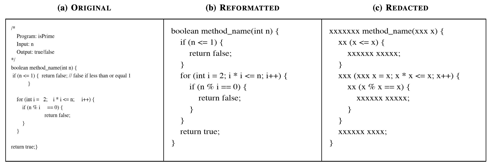
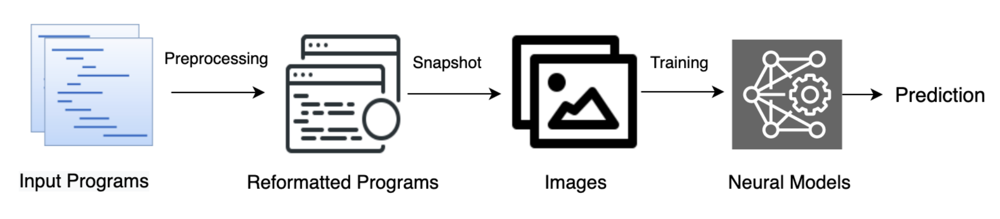

## Code2Snapshot (Encoding Program as Image)

This repository contains the artifact of our paper [Code2Snapshot: Using Code Snapshots for Learning Representations of Source Code](https://doi.org/10.48550/arXiv.2111.01097) accepted at [ICMLA'22](https://www.icmla-conference.org/icmla22/acceptedpapers.html).

---

## Structure

```
├── script/
    ├── preprocess     # prepare preprocessed data
    ├── models         # train and predict with models
    ├── summary        # compute summary results
├── output/
    ├── logs           # logging train/val/test status 
    ├── predict        # predicted labels on test set
├── others/            # related draft exp and files
``` 

---

## Example

||
:--------------------------------------------------------:
|           Example of different code snapshots.           |

---

## Workflow

||
:--------------------------------------------------------------:
|        Workflow of the proposed Code2Snapshot approach.        |

---

## Experimental Settings

  * Tasks: Method Name Prediction, Code Classification, Vulnerability Detection.
  * Models:code2vec & code2seq, BiLSTM, AlexNet & ResNet.
  * Datasets: JavaTop10 & JavaTop50, Java-Sort, s-bAbI.

---

## Citation:

[Code2Snapshot: Using Code Snapshots for Learning Representations of Source Code](https://doi.org/10.48550/arXiv.2111.01097)

```
@inproceedings{rabin2022Code2Snapshot,
  author = {Md Rafiqul Islam Rabin and Mohammad Amin Alipour},
  title = {{Code2Snapshot}: Using Code Snapshots for Learning Representations of Source Code},
  booktitle = {Proceedings of the 21st IEEE International Conference on Machine Learning and Applications},
  year = {2022},
  location = {Nassau, The Bahamas},
  series = {ICMLA 2022}
}
```
